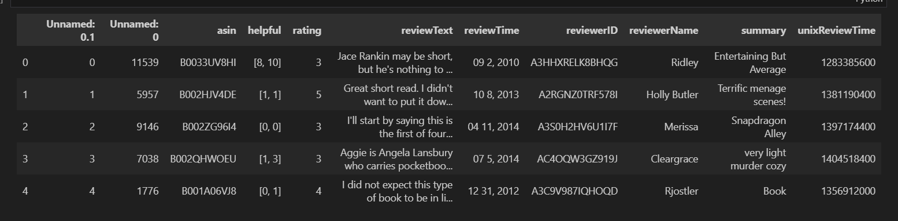
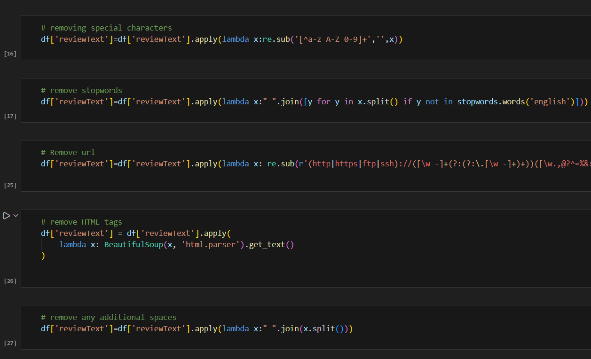
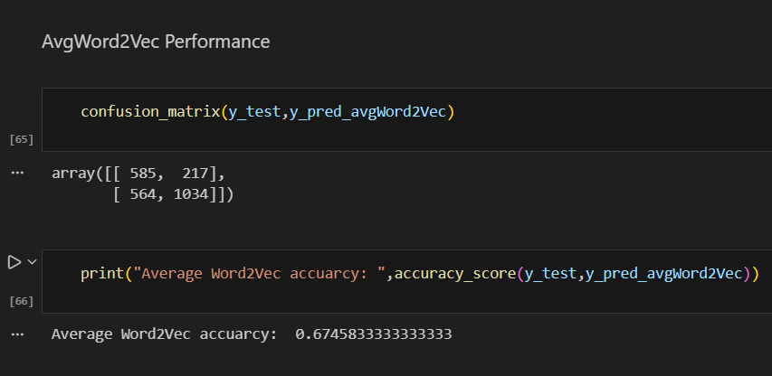

# Kindle-sentiment-analysis

This project is a sentiment analysis using Natural Language Processing(NLP) on Amazon Kindle dataset.

# About Dataset
This is a small subset of dataset of Book reviews from Amazon Kindle Store category.

Content 5-core dataset of product reviews from Amazon Kindle Store category from May 1996 - July 2014. Contains total of 982619 entries. Each reviewer has at least 5 reviews and each product has at least 5 reviews in this dataset. Columns

* asin - ID of the product, like B000FA64PK
* helpful - helpfulness rating of the review - example: 2/3.
* overall - rating of the product.
* reviewText - text of the review (heading).
* reviewTime - time of the review (raw).
* reviewerID - ID of the reviewer, like A3SPTOKDG7WBLN
* reviewerName - name of the reviewer.
* summary - summary of the review (description).
* unixReviewTime - unix timestamp.

For this use case we only need two columns from the dataset - "reviewText" and "rating"*.

---

We follow the following steps:

## STEP 1 - Processing and cleaning

This preprocessing pipeline converts numerical ratings into binary sentiment labels (positive = 1, negative = 0) and cleans raw review text for NLP tasks. 

The steps include case normalization, removal of special characters, URLs, HTML tags, and stopwords, along with whitespace normalization. 

Finally, lemmatization is applied to reduce words to their root form, ensuring cleaner and more meaningful textual features for downstream sentiment analysis models.

---

## STEP 2 - Train test split

The cleaned review text and corresponding sentiment labels are divided into training and test sets using an 80:20 split. This separation allows the model to be trained on the majority of the data while being evaluated on unseen samples to assess generalization performance.

---

## STEP 3 - Applying BoW, TF-IDF and AvgWord2Vec

1. Feature Extraction using Bag of Words (CountVectorizer)
  Converted textual reviews into numerical feature vectors using the Bag of Words approach.
  Learned the vocabulary from the training data and transformed both training and test sets into fixed-length count-based vectors.
  Enables traditional machine learning models to process textual data effectively.

2. Feature Extraction using Word2Vec (Average Word Embeddings)
  Trained a Word2Vec model on tokenized training reviews to learn semantic word representations.
  Represented each review by computing the average of its word vectors, resulting in dense numerical embeddings.
  Produced fixed-size vector representations for both training and test data, capturing semantic relationships between words.

---

## ML model training

* We have used Gaussian Naive Bayes as it perfroms well on sparse matrix for training our analysis model.
* Trained the model using BoW,TF-IDF and AvgWord2Vec on the training data respectively.
* Calculated the prediction values for each of the models.
* Based on the predicted and actual test value(y_test) - we have then calculated accuracy score and confusion matrix for all the above three techniques.
* AvgWord2Vec model has the highest accuracy as it works better on large datasets compared to BoW and TF-IDF.

